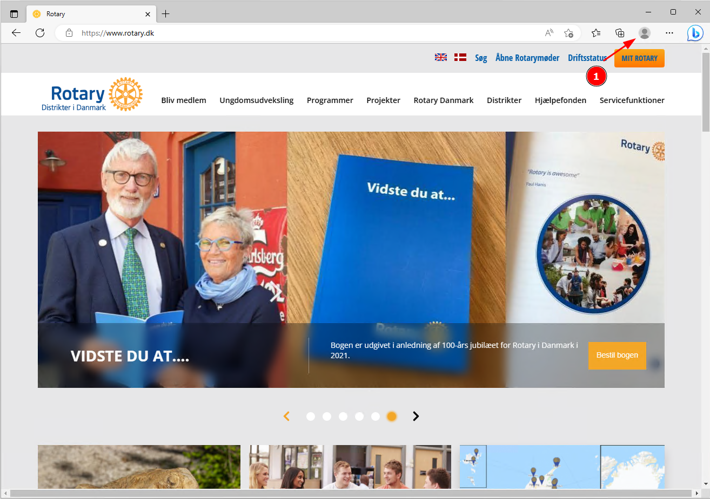

# Opret ny browser profil

Hvis du også er logget ind i Office 365 / Microsoft 365 via dit arbejde kan du med fordel lave en Rotary profil i både Google Chrome og Microsoft Edge. 

1. Adskillelse af personlige oplysninger: En sekundær browserprofil giver dig mulighed for at adskille din personlige browsinghistorik, adgangskoder, gemte formularer og cookies fra din primære browserprofil. Dette er især nyttigt, hvis du deler din computer med andre eller ønsker at holde dine personlige oplysninger adskilt fra dit arbejde.
2. Adgang til forskellige konti: Med en sekundær browserprofil kan du nemt skifte mellem forskellige konti, fx personlige og arbejdskonti på sociale medier eller e-mail-tjenester. Dette kan også hjælpe med at organisere og holde styr på forskellige arbejdsrelaterede eller personlige projekter.

{class="shadow-longer"}

1. Tryk på "Personen/Avatar"

{class="shadow-longer"}

1. Vælg Andre profiler
2. Tryk på Tilføj Profil

{class="shadow-longer"}

Tryk på **Tilføj**

{class="shadow-longer"}

Du har nu en ekstra profil som du kan vælge via genvejen oppe i hjørnet, denne profil deler ikke opsætning med din normale browser profil
