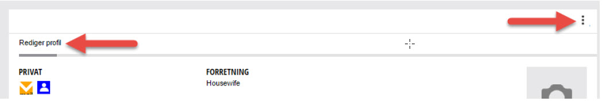
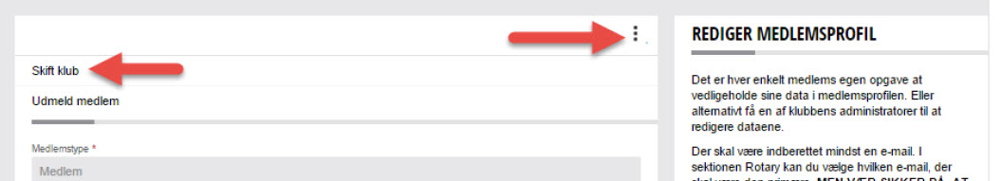
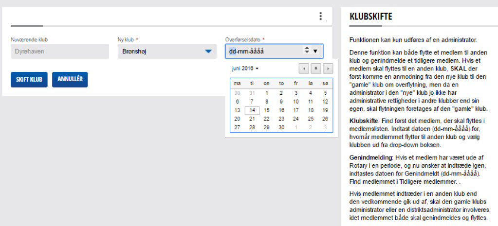

# Flyt et medlem til anden klub

Det er kun muligt at flytte et medlem fra din egen klub.

For at flytte et medlem, skal du gå til medlemsoversigten for klubben.

Vælg det medlem, som skal flyttes og klik derefter på de 3 lodrette prikker, og vælg REDIGER PROFIL.

{class="shadow-longer"}

Siden vises nu i redigeringstilstand, og medlemmet kan nu redigere.

Klik igen på de 3 lodrette prikker og vælg nu menupunktet SKIFT KLUB.

{class="shadow-longer"}

Der fremkommer nu en side, som viser 3 felter.

- nuværemde klub
- Ny klub
- Overførselsdato

{class="shadow-longer"}

<strong>Nyværende klub:</strong> Viser hvilken klub medlemmer er i nu

<strong>Ny Klub:</strong> Her vælges den klub medlemmer skal overføres til 

<strong>Overførselsdato:</strong> Her angives pr. hvilken dato medlemmet skal overføres til den nye klub.

Udfyld felterne Ny klub og overførselsdato og klik herefter på SKIFT KLUB.

!!! info "Husk at klikke på GEM i bunden af skærmen"

    Hvis der er valgt en overførselsdato frem i tiden, vil du ikke kunne se at medlemmet er bliver lagt til overførsel til ny klub. Overførslen vil automatisk ske på den valgte dato.