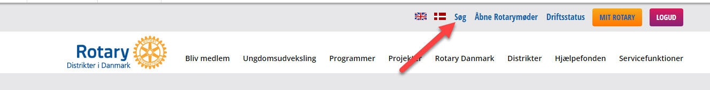
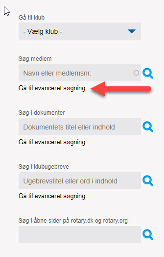
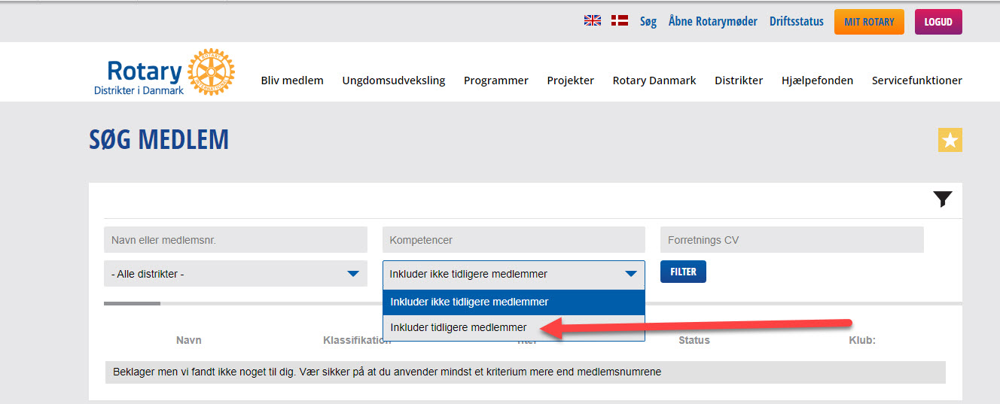
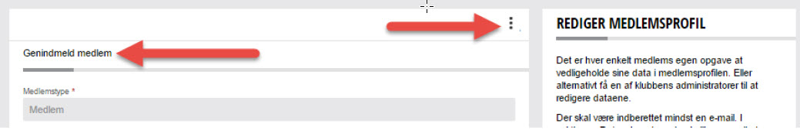

# Genindmeld medlem

Her vises hvordan du genindmelder et medlem.

For at genindmelde et medlem skal du først søge det tidligere medlem frem.

Klik på teksten SØG i toppen af siden.

{class="shadow-longer"} 

Herefter fremkommer følgende skærmbillede. Klik på "Gå tl avanceret søgning".
Du får nu mulighed for at indtaste lidt flere søgekriterier, men vigtigst af alt, så får du en mulighed for at vælge at du vil fremsøge tidligere medlemmer.

{class="shadow-longer"} 

I feltet "Navn eller medlemsnumer" indtaster du det tidligere medlems navn eller medlemsnummer (hvis du kender dette).

{class="shadow-longer"} 

Herefter vises så resultatet af den søgning, du har lavet. Find det medlem i listen, som du ønsker at genindmelde og klik på vedkommendes navn.
Herefter åbner medlemsprofilen, og du skal klikke på de 3 lodrette prikker og derefter på REDIGER PROFIL.
Når du har gjort dette, skal du endnu engang klikke på de 3 lodrette prikker og dernæst vælge menupunktet "Genindmeld medlem".

{class="shadow-longer"} 

ikke færdigt!!!!!!!!!!!!!!!!!!!

!!! warning "Vigtig information om genindmeldelser"

    Du kan .
