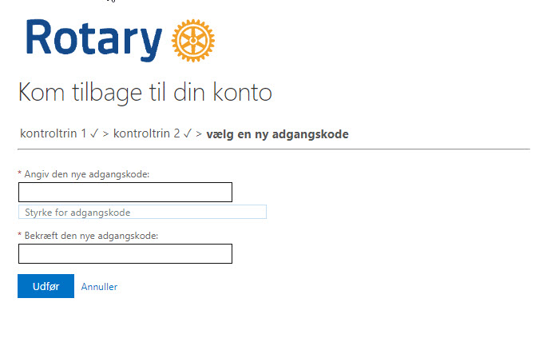

# Har du glemt dit kodeord, kan du nulstille det

Hvis du har glemt dit kodeord, så læs her, hvordan du kan få et nyt.

VEJLEDNING UNDER UDARBEJDELSE

Åbn en browser og indtast følgende internetadresse: [https://portal.rotary.dk](https://portal.rotary.dk){ target=_new }.

Du vil nu blive bedt om at indtaste din emailadresse, indtast den rotary email som du har fået, bestående af dit medlemsnr@rotary.dk.

{class="shadow-longer"}

Indtast din mailadresse og klik på "Næste".

{class="shadow-longer"}

Herefter vil du blive bedt om at indtaste dit kodeord.

{class="shadow-longer"}

Indtast din mailadresse (hvis den ikke allerede er vist) og skriv tegnene som er vist i feltet nedenunder tegnene og klik på "Næste".

{class="shadow-longer"}

Nu skal du vælge den kontaktmetode, som du skal bruge for at lave et nyt kodeord. Væg "Send til min alternative mail". Det er den mail du har oprettet på rotary.dk under din profil (Husk at du IKKE må oprette din rotary mailadresse under din profil, det skal være din private adresse, ellers er der ingen mulighed for at sende dig instruktioner om nyt kodeord).
Klik på "Mail".

{class="shadow-longer"}

Du modtager nu en mail, som indeholder en bekræftelseskode. Indtast denne i det viste felt.

{class="shadow-longer"}

Du får nu en bekræftelses på skærmen om at du har bekræftet din konto.

{class="shadow-longer"}

Nu skal du lave endnu en bekrætelse, og du skal indtaste dit mobilnummer.

{class="shadow-longer"}

Du har modtaget en SMS med en kode, som du skal indtaste i feltet.

{class="shadow-longer"}

Nu får du mulighed for at angive en ny adgangskode. Husk at skrive den i begge felter.

{class="shadow-longer"}

Du har nu fået et nyt kodeord.