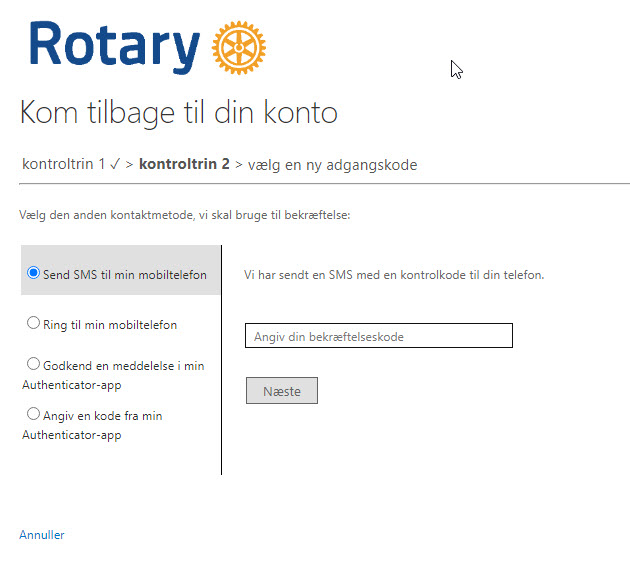
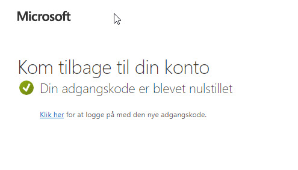

# Har du glemt dit kodeord, kan du nulstille det

Hvis du har glemt dit kodeord, så læs her, hvordan du kan få et nyt.

VEJLEDNING UNDER UDARBEJDELSE

Åbn en browser og indtast følgende internetadresse: [https://portal.rotary.dk](https://portal.rotary.dk){ target=_new }.

Du vil nu blive bedt om at indtaste din emailadresse, indtast den rotary email som du har fået, bestående af dit medlemsnr@rotary.dk.

{class="shadow-longer"}

{class="shadow-longer"}

{class="shadow-longer"}

{class="shadow-longer"}

{class="shadow-longer"}

{class="shadow-longer"}

{class="shadow-longer"}

{class="shadow-longer"}

{class="shadow-longer"}

{class="shadow-longer"}