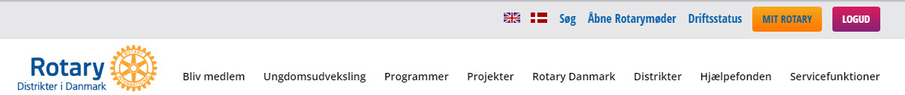

# Medlemssystemet

## Navigation på rotary.dk
På rotary.dk findes der forskellige måder menupunkter vises på.

### Den blå menu
Øverst på rotary.dk findes alle hovedmenuerne.
Indsæt billede med den blå menu
Hovedmenuen indeholder de menupunkter, som der kan ses på billedet. Holder man musen over de enkelte menupunkter, vil der fremkomme flere menupunkter.

### Skjulte menuer
Der findes et antal skjulte menuer på rotary.dk.
Disse fremkaldes ved at klikke på de 3 lodrette prikker, se billede herunder.
Indsæt billede

## Opret nyt medlem
Når man skal oprette et nyt medlem skal man have alle medlemsdata parat, da man skal bruge disse til indtastning af det nye medlem. Der findes et medlemsskema på rotary.dk som man kan benytte for at sikre at man har alle relevante data. Skemaet finder du her ...
