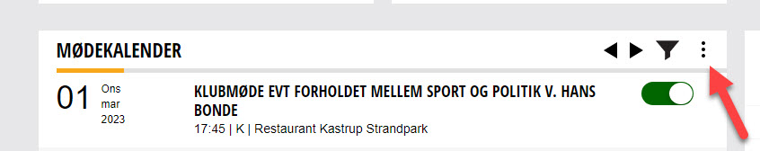

## Vedledning til Rotary Danmarks medlemssystem
På disse sider finder du vejledninger til Rotary Danmarks medlemssystem. Du kan finde de enkelte områder i menuen til venstre, og der er derudover mulighed for at søge efter en vejledning i søgefeltet i øverste højre hjørne.

## Lidt generel information om brugen af rotary.dk
Nedenfor er lidt generelle informationer om hvordan du kan bruge rotary.dk.

## Navigation på rotary.dk
På rotary.dk findes der forskellige måder menupunkter vises på.

### Den blå menu
Øverst på rotary.dk findes alle hovedmenuerne.
Indsæt billede med den blå menu
Hovedmenuen indeholder de menupunkter, som der kan ses på billedet. Holder man musen over de enkelte menupunkter, vil der fremkomme flere menupunkter.

### Skjulte menuer
Der findes et antal skjulte menuer på rotary.dk.
Disse fremkaldes ved at klikke på de 3 lodrette prikker, se billede herunder.
