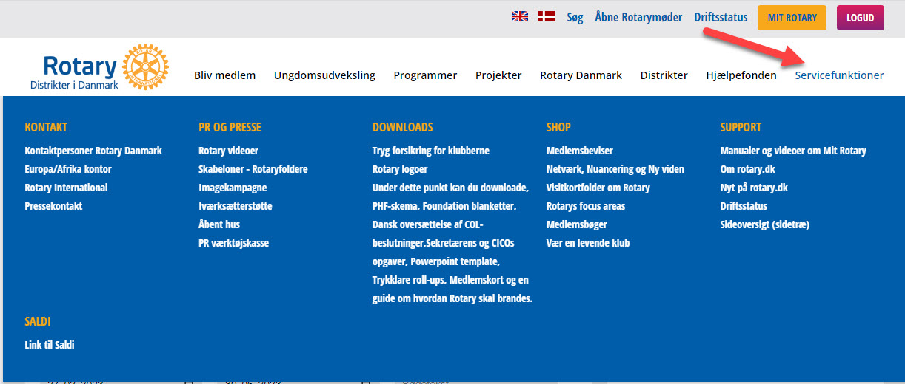
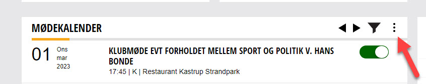
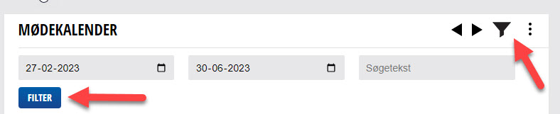

# Generel information om rotary.dk og menustruktur

## Lidt generel information om brugen af rotary.dk
Nedenfor er lidt generelle informationer om hvordan du kan bruge rotary.dk.

## Navigation på rotary.dk
På rotary.dk findes der forskellige måder menupunkter vises på.

### Den blå menu
Øverst på rotary.dk findes alle hovedmenuerne.
Indsæt billede med den blå menu
Hovedmenuen indeholder de menupunkter, som der kan ses på billedet. Holder man musen over de enkelte menupunkter, vil der fremkomme flere menupunkter.

Når man holder musen henover et af menupunkterne, kommer den blå menu frem, se nedenfor.

{class="shadow-longer"}

### Skjulte menuer
Der findes et antal skjulte menuer på rotary.dk.
Disse fremkaldes ved at klikke på de 3 lodrette prikker, se billede herunder.
{class="shadow-longer"}

### Filtrering af oplysninger
Ved at bruge tragt ikonet, kan man fremsøge efter data i en given periode. F.eks. på mødekalenderen vil man kunne få vist møder i et datointerval, se nedenstående billede, som viser skærmbilledet efter at der er klikket på tragt ikonet. Indtast i dette tilfælde det ønskede datointerval og klik derefter på "Filer".
{class="shadow-longer"}
