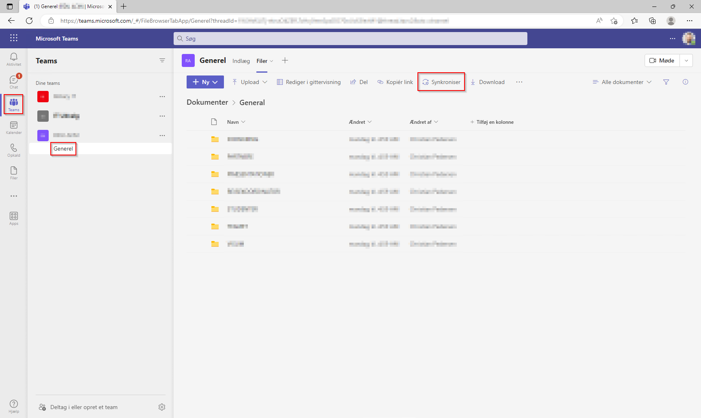
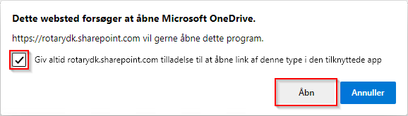
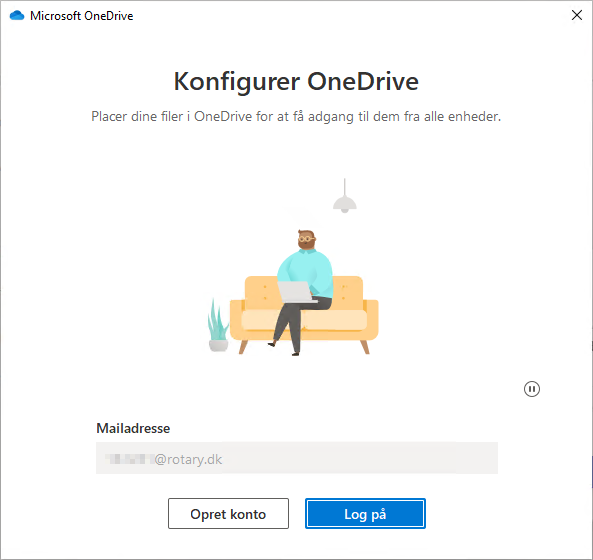
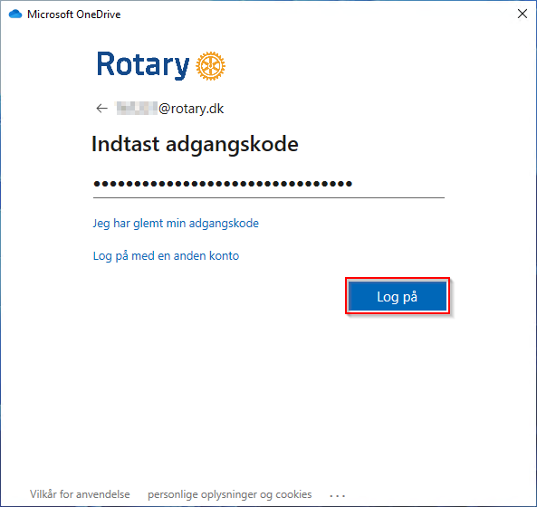
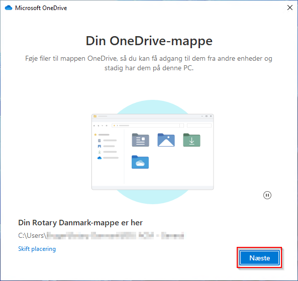
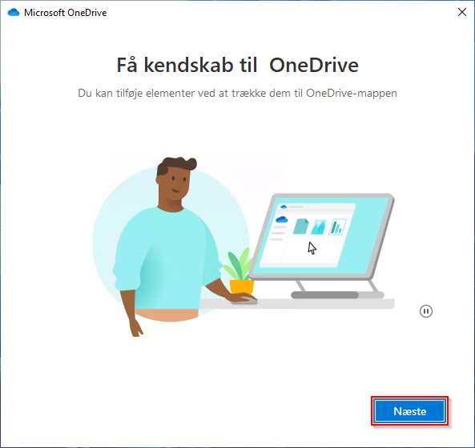
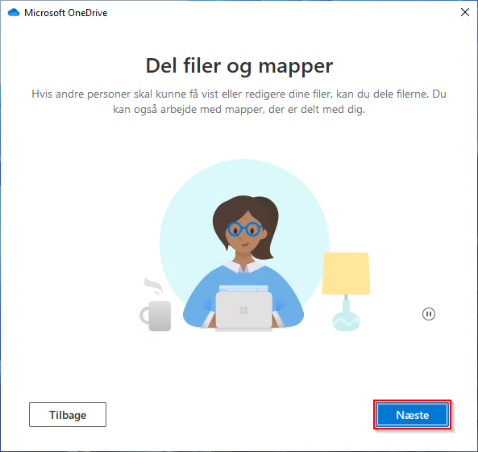
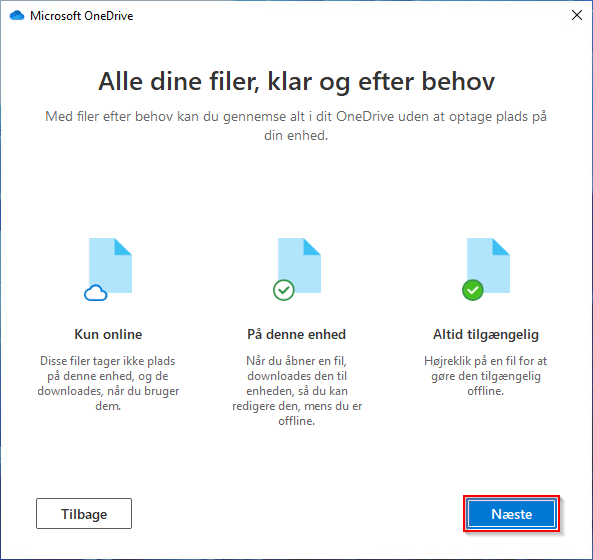
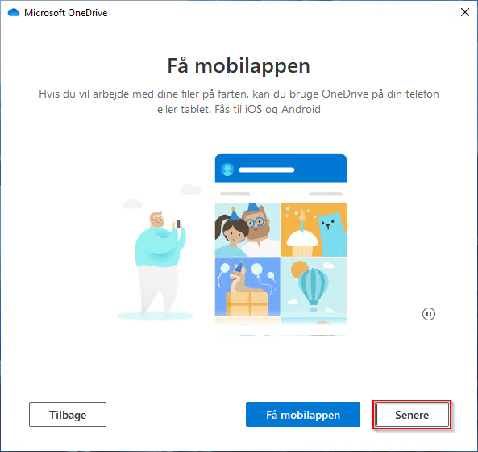
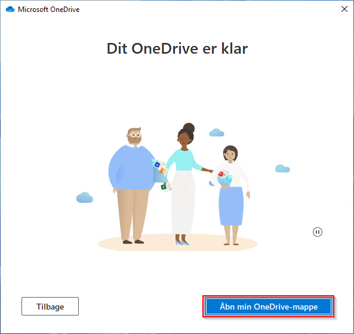

# Tilslut mappe fra Teams via OneDrive

Denne sektion beskriver hvordan du bruger OneDrive til at synkronisere dine filer ned i din stifinder

Du behøver ikke gøre dette men kan sagtens åbne filerne direkte i :material-microsoft-teams: Teams via [teams.microsoft.com](https://teams.microsoft.com/){ target=_new }

## OneDrive

Hvis du ikke har OneDrive på din PC kan du kan hente :material-microsoft-onedrive: OneDrive via [microsoft.com](https://www.microsoft.com/en-ww/microsoft-365/onedrive/download){ target=_new }

## Åben Teams

Du kan åbne :material-microsoft-teams: Teams via [teams.microsoft.com](https://teams.microsoft.com/){ target=_new }, du skal så vælge det Team du vil forbinde til

{class="shadow-longer"}

Vælg dit **Team** og tryk **Generelt** / **Filer** / **Synkroniser**

{class="shadow-longer"}

Tryk på **Giv altid...** og tryk **Åbn**

{class="shadow-longer"}

Tjek dit brugernavn er korrekt **\<rotary nummer>**@rotary.dk og tryk **Log På**

{class="shadow-longer"}

Indtast din adgangskode og tryk **Log på**

{class="shadow-longer"}

Tryk **Næste**

{class="shadow-longer"}

Tryk **Næste**

{class="shadow-longer"}

Tryk **Næste**

{class="shadow-longer"}

Tryk **Næste**

{class="shadow-longer"}

Tryk **Næste**

{class="shadow-longer"}

Tryk på **Åbn min OneDrive-mappe**

Nu er du klar og kan hente dine filer via Stifinder