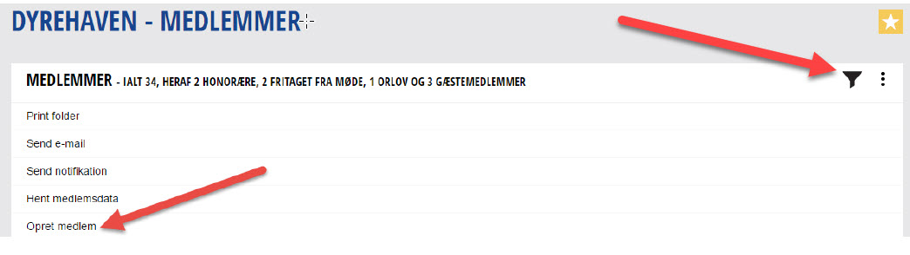

## Hvordan oprettes et nyt medlem?

Når man skal oprette et nyt medlem skal man have alle medlemsdata parat, da man skal bruge disse til indtastning af det nye medlem. Der findes et medlemsskema på rotary.dk som man kan benytte for at sikre at man har alle relevante data. Du kan også hente skemaet <a href=https://help.rotary.dk/documents/Oprettelsesskema_nye_medlemmer-formular.pdf target=_blank>her</a>.

For at kunne oprette et nyt medlem skal du have administrativ adgang til din klubs sider på rotary.dk. Dette gives normalt til sekretær og CICO, som kan varetage disse opgaver.

For at oprette et nyt medlem skal du:

- Gå ind på Mit Rotary
- Klikke på menupunktet medlemmer
- Klikke på de 3 lodrette prikker i højre side
- Vælg punktet "opret medlem"

