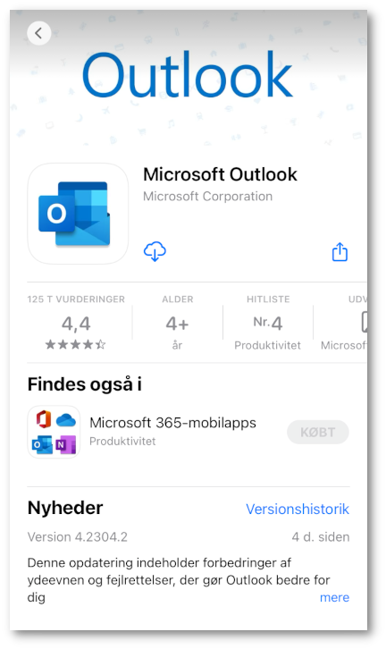
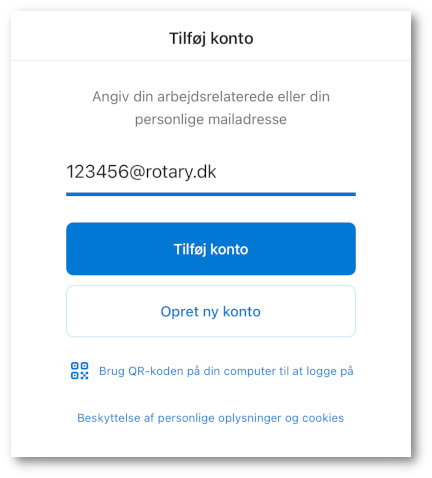

# Outlook på mobil telefonen

Denne sektion kommer til at indeholde en vejledning til at sætte Outlook op på mobiltelefonen, det er ikke muligt at bruge den lokale Apple eller Android mail da denne ikke understøtter delte postkasser, og alle funtions postkasser på Rotary's mail system benytter delte postkasser

## Hente Outlook

:material-apple: [iPhone eller iPad fra App Store](https://apps.apple.com/dk/app/microsoft-outlook/id951937596?l=da)

:material-android: [Android / Google fra Play Store](https://play.google.com/store/apps/details?id=com.microsoft.office.outlook)

## Opsætning af Outlook på :material-apple: enheder

Når du starter outlook 1. gang skal du oprette en konto, så du skal logge ind med __rotarynummer@rotary.dk__ som vist nedenfor

Når du har skrevet din kode skal trykke på __Måske senere__

## Tilslutte funktions postkasse

Du kan se navnet på dine funktions postkasser via <a href=https://portal.rotary.dk target=_blank>portal.rotary.dk</a>, du skal bruge selve email adressen på de funktions postkasser du skal tilslutte