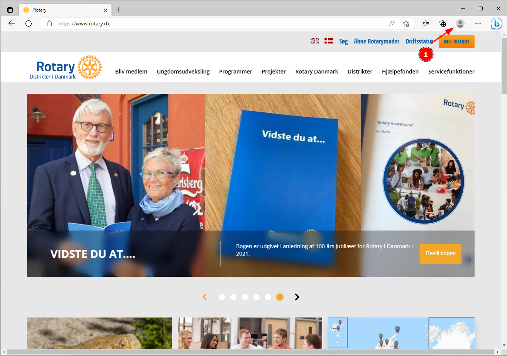
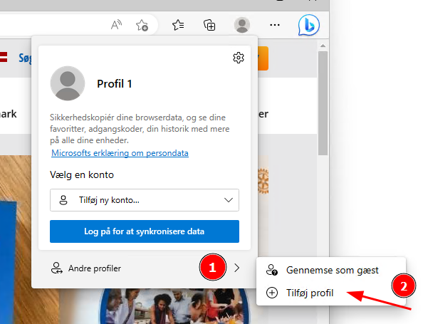
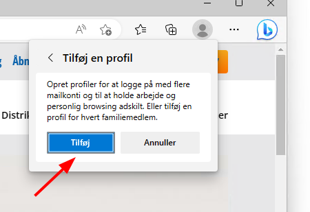
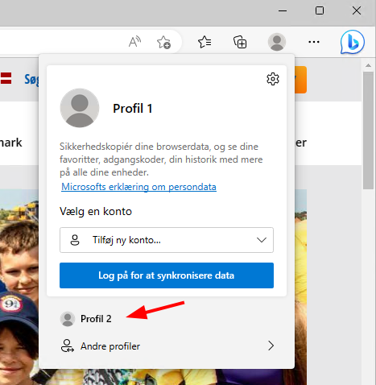
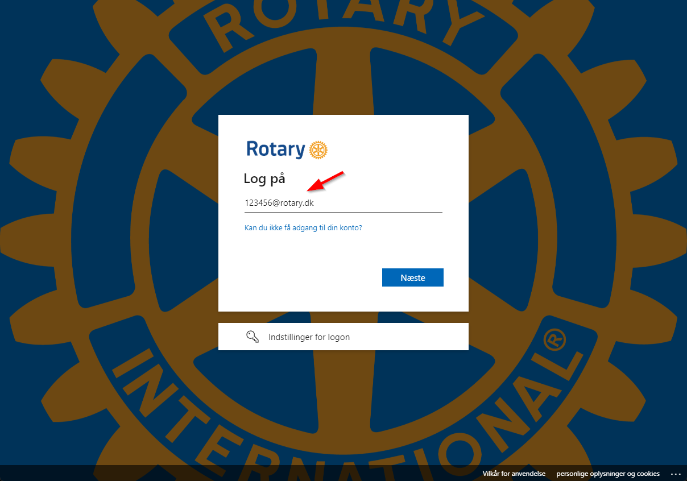
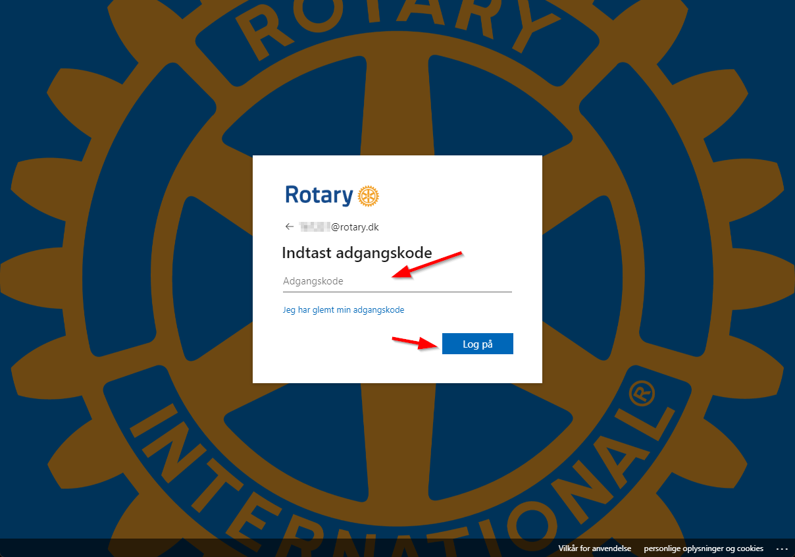
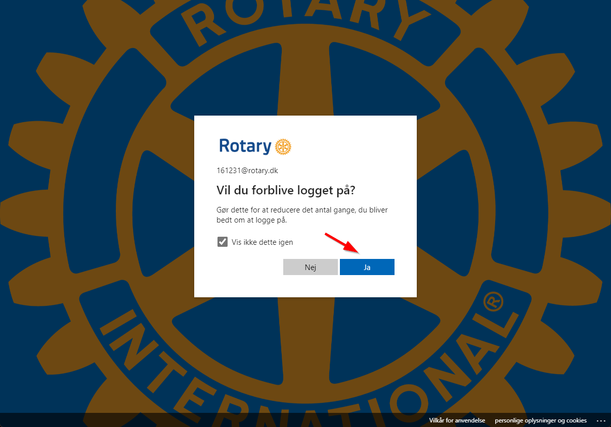
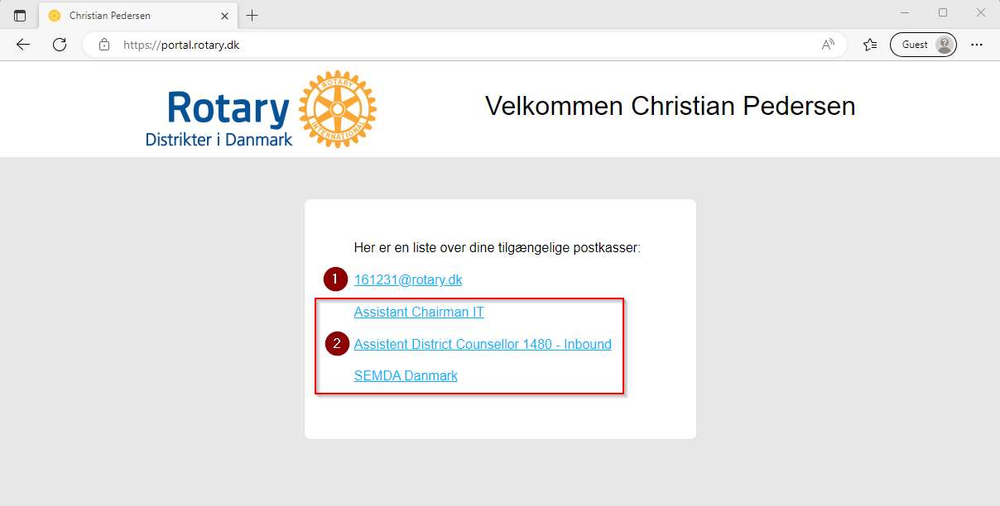
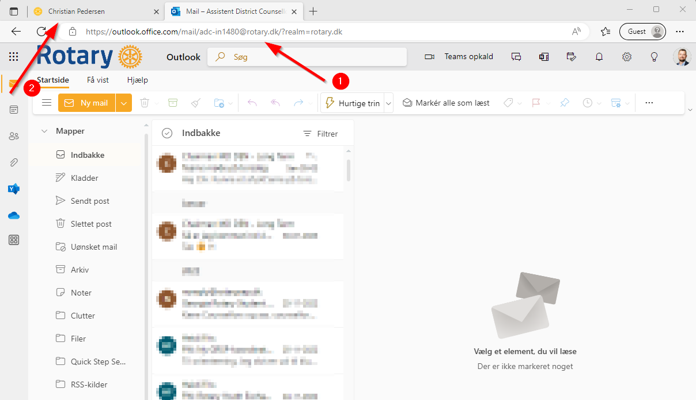

# Rotary portal (Office 365)

For at gøre det lettere for medlemmer at tilgå sin Rotary funktionspostkasse har vi lavet en portal som hedder [https://portal.rotary.dk](https://portal.rotary.dk){ target=_new }, denne portal gør det nemt at få et overblik over de funktions postkasser man har stillet til rådighed.

## Opret ny browser profil (Valgfri)

Hvis du også er logget ind i Office 365 / Microsoft 365 via dit arbejde kan du med fordel lave en Rotary profil i både Google Chrome og Microsoft Edge. 

1. Adskillelse af personlige oplysninger: En sekundær browserprofil giver dig mulighed for at adskille din personlige browsinghistorik, adgangskoder, gemte formularer og cookies fra din primære browserprofil. Dette er især nyttigt, hvis du deler din computer med andre eller ønsker at holde dine personlige oplysninger adskilt fra dit arbejde.
2. Adgang til forskellige konti: Med en sekundær browserprofil kan du nemt skifte mellem forskellige konti, fx personlige og arbejdskonti på sociale medier eller e-mail-tjenester. Dette kan også hjælpe med at organisere og holde styr på forskellige arbejdsrelaterede eller personlige projekter.

{class="shadow-longer"}

1. Tryk på "Personen/Avatar"

{class="shadow-longer"}

1. Vælg Andre profiler
2. Tryk på Tilføj Profil

{class="shadow-longer"}

Tryk på **Tilføj**

{class="shadow-longer"}

Du har nu en ekstra profil som du kan vælge via genvejen oppe i hjørnet, denne profil deler ikke opsætning med din normale browser profil

## Logge på portal.rotary.dk

{class="shadow-longer"}

Dit brugernavn er **<rotary nummer\>@rotary.dk** og tryk derefter på **Næste**

{class="shadow-longer"}

Skriv din adgangskode og tryk på **Log på**

{class="shadow-longer"}

Hvis du er på din egen computer kan du trykke på **Vis ikke dette igen** og vælge **Ja**, men er du på en computer som ikke er din egen anbefales det at du trykker **Nej** da du så næste gang du logger på skal skrive din adgangskode igen

{class="shadow-longer"}

På denne side kan du se dine mail adresser

1. Dette er din personlige mail adresse som er **<rotary nummer\>@rotary.dk**, denne bruges til Teams og møder f.eks.
2. Dette er listen over de funktions postkasser du er tildelt rettigheder til

{class="shadow-longer"}

Når du klikker på en af dine mail adresser åbner din browser en ny fane med den mailbox i du har trykket på.

1. Her kan du se hvad mailbox du er i aktuelt
2. Tryk her for at vende tilbage til oversigten
