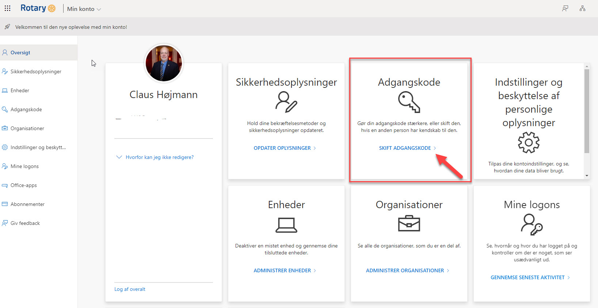

# Hvordan ændrer jeg mit kodeord på Microsoft 365 platformen?

Når du vil skifte dig kodeord, skal du gå til denne adresse: <a href=https://myaccount.microsoft.com/ target=_blank>myaccount.microsoft.com/</a>.

Hvis du ikke allerede er logget på, vil du blive bedt om at logge på.

Når du er logget på, vil du se nedenstående skærmbillede:

{class="shadow-longer"}

Når ovennævnte skærmbilledet vises på skærmen, skal du klikke på "Skift adgangskode".

Du får dernæst vist nedenstående skærmbillede.

{class="shadow-longer"}

Indtast dit nuværende kodeord og derefter dit nye kodeord i 2 felter som vist på billede.

Klik til sidst på "Send" og dit kodeord er rettet.