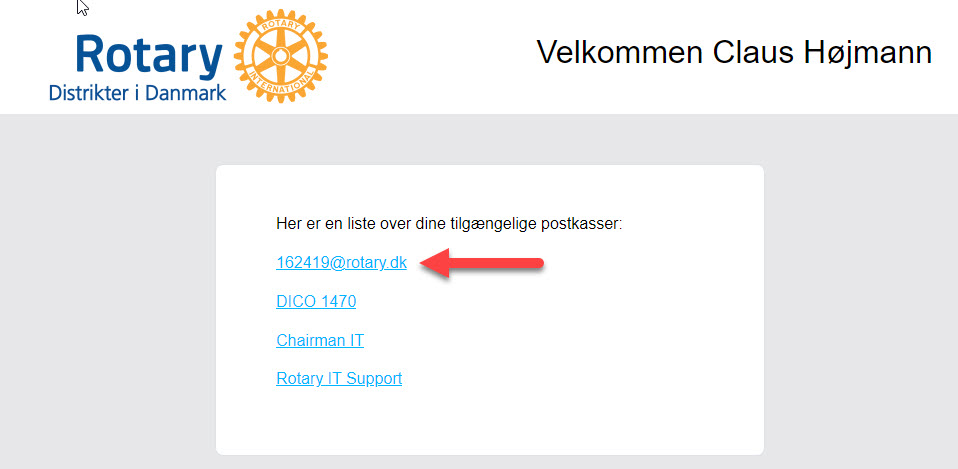

# Hvordan bruger vi Teams i Rotary Danmark

## Opret et Teamsmøde
Gå på portal.rotary.dk og log på din officekonto med dit brugernavn (medlemsnr@rotary.dk) og din adgangskode.

Klik på linket med dit medlemsnr@rotary.dk.
Du kommer nu ind i din mailboks.

Du skal nu gå til din kalender - klik på kalenderikonet, som vist på billedet.

Din kalender bliver nu vist. Vælg dato for mødet, og klik på....

xx

xx

