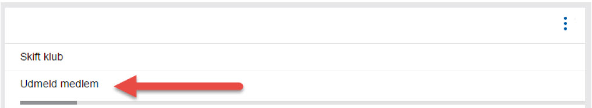
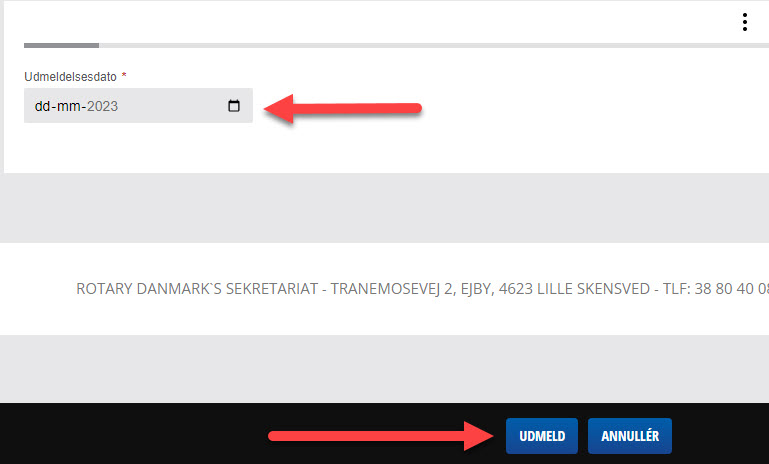

# Udmeld medlem

Her vises hvordan du udmelder et medlem.

For at udmelde et medlem, skal du gå til medlemsoversigten for klubben.

Vælg det medlem, som skal udmeldes og klik derefter på de 3 lodrette prikker, og vælg REDIGER PROFIL.

{class="shadow-longer"} 

Siden vises nu i redigeringstilstand, og medlemmet kan nu redigeres.

Klik igen på de 3 lodrette prikker og vælg nu menupunktet UDMELD MEDLEM.

{class="shadow-longer"}

Indtast herefter dato for udmeldelsen og klik på UDMELD knappen.

{class="shadow-longer"}

!!! info "Husk at klikke på Udmeld"

    Hvis der ikke klikkes på UDMELD knappen i bunden af skærmen, vil medlemmet ikke bliver udmeldt. Er der valgt en ud,udmeldelsesdato frem i tiden, vil du ikke kunne se at medlemmet er udmeldt før dato nås.